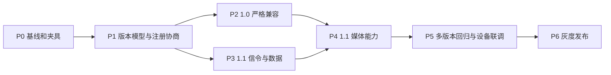

# GB/T 28181-2011/2014 AI 开发执行计划

## 1. 用途

本文是 [GB/T 28181-2011/2014 支持开发方案](GB28181-2011-2014-support-plan.md) 的执行计划，供 AI 编码代理、人工评审人员和设备联调人员共同使用。

目标是把总体方案拆成可独立开发、测试、审查和回滚的任务包。第一阶段只覆盖平台作为 SIP 服务端接入下级 IPC/NVR/网关，不包含完整上下级平台级联。

当前执行状态（2026-08-26）：P0～P4、AI-501 和 AI-502 已完成代码与自动化/模拟器验证；AI-401 已按附录 Q 修正为接收者主动 INVITE，并补齐 ZLMediaKit RTP 发送媒体闭环。设备编辑接口支持 `gb_disabled_capabilities`，可对厂商固件缺失的单项能力做关闭覆盖。上下级视频平台已补齐 2014+ `ConfigDownload`/`DeviceConfig`、2022 升级/抓拍最终通知和主动视频上传通知级联，并按 1.0/1.1/2.0/3.0 门禁。2011/2014/2016 规范性附录 G 的综合接处警/卡口系统接口尚未实现，若要求完整标准覆盖，必须另立领域模块工作包，不能计入当前完成项。AI-503 真实设备矩阵和 AI-602 部署灰度/回滚仍需按 [四版本联调执行手册](testing/gb28181-interoperability-runbook.md) 在目标环境执行。AI-403 采用 Owl 内置 TCP 客户端方案，保持默认关闭并按设备白名单启用。每次代码更新后必须重新执行 AI-601，历史通过记录不能替代当前工作树验证。

## 2. 团队和职责

建议最小配置：

| 角色 | 职责 |
|---|---|
| 技术负责人 | 确认协议解释、审批数据模型和阶段门，不负责逐行代写 |
| AI 编码代理 | 读取 CodeGraph、编写代码和测试、执行验证、提交变更说明 |
| 人工评审 | 检查协议语义、兼容性、并发和错误处理，批准合并 |
| 设备联调/测试 | 准备设备、抓取 SIP 报文、执行验收矩阵、登记厂商差异 |

AI 可以承担代码定位、样板代码、单元测试、报文夹具、重构和问题诊断；以下工作不能只由 AI 推断：

- 标准条款存在歧义时的最终业务取舍；
- 厂商设备真实行为和固件缺陷判断；
- 2014 直接 TCP 下载与媒体服务器的集成方案；
- 正式检测认证结果。

## 3. AI 执行规则

每个任务必须遵循：

1. 开始前运行 `git status --short`，保留用户和其他任务的已有修改。
2. 仓库存在 `.codegraph/`，定位和理解代码必须先运行 `codegraph explore`。
3. 一次只处理一个任务卡，不夹带重构、依赖升级或无关格式化。
4. 先增加失败测试或报文夹具，再做最小实现。
5. 兼容现有 `2011/2016/2022` 存储值和 HTTP API；迁移必须可回滚。
6. 不允许用“设备可能支持”代替能力判断和验收证据。
7. 未运行的测试必须明确写成“未执行”，不得声称通过。
8. 不主动提交或推送代码；人工确认任务结果后再决定是否创建提交。

禁止在普通任务中直接执行 `make audit`，因为它会对全仓库运行 `gofumpt -w .`，可能格式化无关文件。验证按以下层次执行：

```bash
# 修改 Go 文件后，只格式化本任务文件
gofmt -w <changed-go-files>

# 包级快速验证
go test ./pkg/gbs/sip
go test ./pkg/gbs
go test ./pkg/gbs/...

# 涉及设备持久化/API 时
go test ./internal/core/ipc/...

# 阶段完成时
go vet ./...
go test ./...

# 发布候选版本
go test -race -vet=off ./...
```

## 4. 任务完成定义

一个 AI 任务只有同时满足以下条件才能标记完成：

- 需求和非目标已明确；
- 只修改任务卡允许的文件，或说明新增文件的必要性；
- 新行为有单元测试或 golden 报文覆盖；
- 相关包测试通过；
- `git diff --check` 通过；
- 没有降低 2.0/3.0 现有行为；
- 输出实际修改、实际验证、未验证项和真实风险；
- 人工评审通过。

涉及真实设备的任务还必须附带：设备厂商、型号、固件、网络模式、SIP 报文和结果。

## 5. 阶段和依赖关系



P0、P1 必须串行完成。P1 通过后，P2 与 P3 中不修改同一文件的任务可以由不同 AI 工作流并行，但合并前必须基于同一最新分支重新验证。

## 6. P0：基线和报文夹具

### AI-000：建立当前测试基线

目标：记录实现前的可重复基线，避免把已有失败误判为本次回归。

操作：

1. 记录 Go 版本、操作系统和当前提交；
2. 执行 `go test ./pkg/gbs/...`；
3. 执行 `go test ./internal/core/ipc/...`；
4. 记录失败测试、外部服务依赖和耗时；
5. 不修改业务代码。

交付：`docs/testing/gb28181-baseline.md`，包含命令、时间、结果和已知失败。

完成标准：后续任务能够区分新增失败和基线失败。

估算：AI 0.5 天，人工复核 0.25 天。

### AI-001：建立四版本最小报文夹具

目标：建立 `1.0/1.1/2.0/3.0` 可用于 golden 测试的最小报文集。

新增目录：

```text
pkg/gbs/testdata/gb28181/1.0/
pkg/gbs/testdata/gb28181/1.1/
pkg/gbs/testdata/gb28181/2.0/
pkg/gbs/testdata/gb28181/3.0/
```

首批夹具：REGISTER 首次请求、401、鉴权 REGISTER、200、Keepalive、Catalog 请求/响应和实时 INVITE SDP。

约束：

- 使用标准示例的必要字段，不复制无关大段标准正文；
- 报文使用 CRLF；
- Content-Length 与实际字节长度一致；
- 同一场景只改变版本相关字段。

完成标准：夹具能被现有 SIP/XML 解析器加载；差异经过人工对照标准确认。

估算：AI 1 天，人工协议复核 0.5 天。

阶段门 G0：技术负责人确认版本映射和首批报文后，才能修改版本协商代码。

## 7. P1：版本模型和注册协商

### AI-101：引入规范版本类型和能力矩阵

依赖：AI-001。

修改范围：

- `pkg/gbs/version.go`
- 新增 `pkg/gbs/version_test.go`

实现：

1. 定义 `1.0/1.1/2.0/3.0`；
2. 兼容解析历史值 `2011/2016/2022`；
3. 定义标准名称和 `X-GB-Ver` 映射；
4. 定义能力矩阵，不把版本比较散落到业务代码；
5. 未知值返回显式错误或保守档案，不能静默变成 3.0。

测试：版本解析、历史值兼容、未知值、能力矩阵和序列化。

完成标准：版本和能力逻辑不依赖 `GB28181API`，可以独立测试。

估算：AI 1～1.5 天，人工复核 0.5 天。

### AI-102：支持 `X-GB-Ver: 1.1`

依赖：AI-101。

修改范围：

- `pkg/gbs/sip/context.go`
- `pkg/gbs/sip/header.go`
- 对应测试文件

实现：

1. 解析 `1.0/1.1/2.0/3.0`；
2. Header Builder 接受规范版本类型；
3. 保留对未知扩展版本的原始值用于日志；
4. 不再把 `X-GB-Ver` 转成只有年份的字符串后丢失 `1.1` 信息。

测试：大小写、空白、重复头、未知版本和无版本头。

估算：AI 1 天，人工复核 0.25 天。

### AI-103：设备版本持久化和手动覆盖

依赖：AI-101。

修改范围：

- `internal/core/ipc/model.go`
- `internal/core/ipc/device.param.go`
- 设备编辑 Usecase/Store 相关文件
- `pkg/gbs/devices.go`

实现：

1. 保存声明版本、有效版本和版本来源；
2. 兼容现有 `Ext.GBVersion`；
3. 增加可选手动版本字段；
4. REGISTER/Keepalive 未携带版本时不得清空已有值；
5. 手动版本优先级高于设备声明，清除手动值后恢复自动协商。

测试：JSON 兼容、编辑接口、数据库旧数据、空头注册和重启加载。

估算：AI 1.5～2 天，人工复核 0.5 天。

### AI-104：完成 REGISTER 版本协商

依赖：AI-102、AI-103。

修改范围：

- `pkg/gbs/register.go`
- 必要的 SIP Response/Header 辅助函数
- 注册测试

实现：

1. 401、成功 200 和注册失败响应携带平台版本；
2. 计算设备声明、平台最高版本和手动覆盖后的有效版本；
3. 不带版本的首次设备采用配置的保守默认值；
4. 记录结构化协商日志；
5. 注销不破坏已确认版本。

测试至少覆盖：

- 1.0/1.1/2.0/3.0 注册；
- 无版本头；
- 高于平台支持的版本；
- 密码错误；
- 注销；
- 手动覆盖。

估算：AI 2 天，人工复核 0.75 天。

### AI-105：统一下行请求版本和注册后探测

依赖：AI-104。

修改范围：

- `pkg/gbs/catalog.go` 中的 `wrapRequest`
- `pkg/gbs/sip/context.go` 中的 `SendRequest`
- `pkg/gbs/register.go` 注册后查询

实现：

1. 所有下行请求使用 `EffectiveVersion`；
2. 删除未知版本默认发送 3.0 的行为；
3. 1.0 注册后只发送 DeviceInfo/Catalog；
4. 1.1 以上才自动发送受支持的 ConfigDownload；
5. 2.0/3.0 原有行为保持不变。

测试：按版本比较完整 SIP 请求 golden 文件。

估算：AI 1.5 天，人工复核 0.5 天。

阶段门 G1：四个版本 REGISTER golden 测试通过，且人工确认未知版本不会收到 3.0 后，才能进入业务适配。

## 8. P2：1.0 严格兼容

### AI-201：增加 1.0 功能门禁

依赖：G1。

修改范围：`pkg/gbs/version.go`、控制/查询/订阅/语音入口。

实现：

- 1.0 禁止 ConfigDownload、Broadcast、Talk、RTP over TCP 和 2022 命令；
- 返回统一的“不受当前协议档案支持”错误；
- 不影响设备主动上报的宽松解析。

测试：每个受限入口至少一个拒绝用例，2.0/3.0 对应成功路径保持。

估算：AI 1.5 天，人工复核 0.5 天。

### AI-202：抽取并实现 1.0 SDP 档案

依赖：AI-201。

修改范围：

- `pkg/gbs/play.go`
- `pkg/gbs/history.go`
- 新增小型 SDP Builder 文件和测试

实现：

1. 复用直播、回放和下载公共字段；
2. 1.0 只生成 RTP/AVP UDP；
3. 不生成 `setup/connection`；
4. 正确生成 `s/u/t/y/f` 和 Subject；
5. 保持 2.0/3.0 当前 SDP 输出或以 golden 差异明确评审。

估算：AI 2～3 天，人工复核 0.75 天。

### AI-203：1.0 XML 和业务回归

依赖：AI-201、AI-202。

范围：注册、心跳、DeviceInfo、Catalog、PTZ、RecordInfo、Alarm。

实现原则：以宽松解析兼容厂商缺失可选字段；下行 XML 只发送 1.0 定义字段。

完成标准：SIP 模拟流程完成 REGISTER → Keepalive → Catalog，并覆盖平台主动点播使用的 1.0 UDP SDP、录像和报警。非广播入向 INVITE 属于完整级联被叫流程，不得用回显 SDP 代替 B2BUA 和媒体转发实现。

估算：AI 2 天，人工复核 0.5 天。

阶段门 G2：至少一个 1.0 模拟器通过全部核心流程；有真实设备时，至少一个真实设备通过注册、目录和 UDP 实时点播。

## 9. P3：1.1 信令和数据能力

### AI-301：Catalog 扩展字段和目录树

依赖：G1。

修改范围：

- `pkg/gbs/devices.go`
- `pkg/gbs/catalog.go`
- `internal/core/ipc` 通道扩展模型和保存逻辑

增加 `ParentID`、`Block`、`IPAddress`、`Port`、经纬度、摄像机属性、`BusinessGroupID` 等字段。未知扩展保留原始 XML，不因可选字段缺失拒绝整包。

测试：行政区划、系统、业务分组、虚拟组织、设备五类目录项及分包响应。

估算：AI 2～3 天，人工复核 0.75 天。

### AI-302：ConfigDownload 和 DeviceConfig

依赖：AI-105。

修改范围：

- `pkg/gbs/config.go`
- `pkg/gbs/model.go`
- `pkg/gbs/query_state.go`
- API 输入输出模型

实现：BasicParam 完整读写；其他 1.1 配置类型先保证可查询、可保存原始 XML、可返回明确“不支持写入”，不在一个任务中虚构所有设备配置业务。

测试：请求、200、业务 Response、超时、错误 Result、未知配置类型。

估算：AI 2～3 天，人工复核 0.75 天。

### AI-303：MediaStatus 结束通知

依赖：AI-105。

修改范围：

- `pkg/gbs/server.go`
- 新增或复用媒体状态处理文件
- `pkg/gbs/history.go`、`pkg/gbs/stream.go`

实现：注册 MESSAGE 路由；关联 Call-ID/DeviceID/ChannelID；结束回放/下载状态；幂等处理重复通知；未知会话仍返回可互通的响应并记录日志。

估算：AI 1.5～2 天，人工复核 0.5 天。

### AI-304：通用多响应聚合

依赖：AI-301。

范围：Catalog、RecordInfo 以及后续需要分包的查询。

实现：统一聚合键、总数、去重、乱序、超时、部分结果和清理机制；避免复制新的 `sync.Map` 等待实现。

测试：乱序、重复、总数错误、最后一包丢失、并发相同设备查询。

估算：AI 2～3 天，人工复核 0.75 天。

### AI-305：目录订阅通知

依赖：AI-301、AI-304。

修改范围：

- `pkg/gbs/subscribe.go`
- `pkg/gbs/subscribe_source.go`
- `pkg/gbs/server.go`

实现：生成和解析 `Event: Catalog;id=...`；支持初始订阅、续订、取消、Expires、NOTIFY 和确认；Alarm/MobilePosition/PTZPosition 上级订阅应自动映射到下级设备/通道，按引用计数复用并在退订、过期或上级移除时释放；Alarm 复用 A.2.4 的级别、方式、类型和时间过滤参数。

测试：订阅状态机、过期清理、重复订阅、不同事件并存、上下级续订/退订桥接、多个上级复用同一下级订阅以及 Alarm 过滤。

估算：AI 2～3 天，人工复核 0.75 天。

阶段门 G3：1.1 模拟器完成 Catalog 扩展、ConfigDownload、MediaStatus、多响应和目录订阅；所有测试均使用 `X-GB-Ver: 1.1`。

## 10. P4：1.1 媒体能力

### AI-401：语音广播标准时序

依赖：G3。

修改范围：

- `pkg/gbs/voice.go`
- `pkg/gbs/server.go`
- Broadcast 请求/应答模型

实现：MESSAGE Broadcast 通知 → 200 → Broadcast Response → 200 → 语音接收者主动 INVITE 语音发送者 → 平台启动 ZLM RTP 发送 → 200 SDP → ACK；BYE、断流、超时和主动停止均回收 SIP/RTP 资源。`1.1` 使用 `PT 96/PS/90000`，`2.0/3.0` 使用 `PT 8/PCMA/8000`。语音源必须是 ZLMediaKit 中已就绪的 G.711 A-law 流；LALMAX 不支持时返回明确错误，不允许静默成功。

测试：完整状态机、版本化 SDP、RTP 启停、拒绝、超时、重复 Response、ACK/BYE 和中途停止。

估算：AI 2～3 天，人工复核 0.75 天。

### AI-402：2014 TCP 下载技术验证

依赖：G3。

这是先研究、后编码的阻断任务。AI 必须先输出 ADR：

```text
docs/adr/gb28181-2014-direct-tcp-download.md
```

ADR 必须说明：

- 当前 ZLM/LALMAX 是否支持不经 RTP 封装的 TCP 文件接收；
- TCP 连接由哪一端监听和发起；
- 文件大小、进度、超时和取消如何管理；
- 与 2.0/3.0 RTP over TCP 如何隔离；
- 是否需要扩展媒体服务接口。

没有技术负责人批准 ADR，不进入 AI-403。

估算：AI 1～2 天，人工/媒体负责人复核 1 天。

### AI-403：实现 2014 直接 TCP 下载

依赖：AI-402 ADR 已批准。

实现范围由 ADR 决定。必须独立于现有 RTP over TCP 开关，支持建立、进度、完成、超时、取消和资源清理。

测试：本地发送端模拟器、文件校验和、连接中断、零字节、超时和并发限制。

估算：AI 3～5 天，人工复核 1 天，设备联调另计。

### AI-404：媒体流保活

依赖：AI-303、AI-403。

实现标准保活检测和超时收敛；不重复实现媒体服务器已经可靠提供的检测。先抽象状态事件，再连接 ZLM/LALMAX 回调。

测试：正常数据、长时间无数据、断流恢复、BYE 和 MediaStatus 竞争。

估算：AI 2 天，人工复核 0.5 天。

阶段门 G4：1.1 广播和下载模拟器通过；真实设备不可用时，不能宣称设备兼容完成。

## 11. P5：多版本回归和设备联调

### AI-501：2.0/3.0 自动化回归

依赖：G4。

检查：注册协商、RTP over TCP、语音对讲、2022 升级/抓拍/精确 PTZ/巡航轨迹/存储卡/A.4，以及 ConfigDownload 的标准 `SnapShotConfig` 节点。对 golden 变化逐项解释，禁止直接批量更新快照掩盖回归。

验证：

```bash
go test ./pkg/gbs/...
go test ./internal/core/ipc/...
go vet ./...
go test ./...
```

估算：AI 2 天，人工复核 1 天。

### AI-502：设备诊断信息和管理接口

依赖：AI-103、G4。

增加只读诊断字段：声明版本、有效版本、来源、能力集、最后协商时间、最后不支持命令；允许设置和清除手动版本。保持现有响应字段兼容。

估算：AI 1.5～2 天，人工复核 0.5 天。

### AI-503：真实设备联调和兼容表

由测试人员主导，AI 负责解析报文和生成最小修复。

每个问题建立单独任务，必须附原始报文和设备信息。厂商特例优先放入兼容表或能力覆盖，禁止把某个设备的异常行为改成所有设备默认行为。

最低验收：

| 档案 | 设备 | 验收 |
|---|---:|---|
| 1.0 | 2 厂商 | 注册、心跳、目录、UDP 实时、PTZ、录像、报警 |
| 1.1 | 2 厂商 | 1.0 全部 + 配置、目录扩展、订阅、广播、下载 |
| 2.0 | 1 厂商 | 原有 RTP over TCP、对讲回归 |
| 3.0 | 1 厂商 | 原有 2022 扩展回归 |

估算：测试/联调 8～15 人日，AI 按问题辅助。

## 12. P6：灰度发布

### AI-601：发布候选验证

执行：

```bash
git diff --check
go vet ./...
go test -race -vet=off ./...
```

输出发布验证报告，列出通过、失败、跳过、外部依赖和设备矩阵。不能用局部测试代替全量结果。

### AI-602：灰度和回滚

发布策略：

1. 默认保持现有 2.0/3.0 行为；
2. 先对白名单设备启用 1.0/1.1 自动协商；
3. 1.1 扩展能力分别开关；
4. 观察注册失败率、目录超时率、播放成功率和异常断流；
5. 出现问题时按设备回退有效版本，不回滚整个设备库数据。

阶段门 G5：设备矩阵、全量测试、回滚演练和发布报告全部通过后，才能对外声明支持 1.0/1.1。

## 13. 推荐排期

以 1 名高级工程师使用 AI 编码、1 名测试/联调人员为基准：

| 周期 | 主要任务 | 交付 |
|---|---|---|
| 第 1 周 | P0、P1 | 报文基线、四版本模型、注册协商 |
| 第 2 周 | P2 | 1.0 功能门禁、UDP SDP、核心流程 |
| 第 3 周 | P3 前半 | Catalog、ConfigDownload、MediaStatus |
| 第 4 周 | P3 后半 | 多响应、目录订阅 |
| 第 5 周 | P4 | Broadcast、TCP 下载 ADR/实现、保活 |
| 第 6～7 周 | P5 | 2.0/3.0 回归、真实设备联调 |
| 第 8 周 | P6 | 全量测试、灰度、回滚演练 |

AI 预计降低代码定位、样板实现和单元测试编写成本，但不会等比例降低协议评审和设备联调成本。建议计划口径：

- AI 编码任务：约 20～32 个 AI 任务日；
- 人工设计/评审：约 8～12 人日；
- 设备测试/问题收敛：约 8～15 人日；
- 日历周期：约 6～8 周。

若 AI-402 确认现有媒体服务器无法支持 2014 直接 TCP 下载，需要增加媒体适配开发，排期单独调整。

## 14. AI 任务提示词模板

每张任务卡可使用以下模板启动 AI：

```text
你正在实现任务 <TASK-ID>：<任务名称>。

目标：
<只描述本任务最终行为>

允许修改：
<文件和符号>

禁止：
- 无关重构
- 修改未列出的业务行为
- 引入新依赖
- 破坏 2.0/3.0 兼容
- 未验证却声称测试通过

执行要求：
1. 先检查 git status。
2. 先使用 codegraph explore 定位符号、调用链和影响范围。
3. 先增加失败测试或 golden 报文。
4. 做最小实现。
5. 仅格式化本任务修改的 Go 文件。
6. 运行任务卡要求的包级测试和 git diff --check。

完成标准：
<复制任务卡中的完成标准>

交付格式：
- 假设
- 修改
- 验证（区分已执行/未执行）
- 风险
```

## 15. 建议的变更批次

为降低 AI 产生大补丁的风险，建议每个变更批次只包含一组紧密相关任务：

| 批次 | 任务 | 建议提交信息 |
|---|---|---|
| 1 | AI-000～AI-001 | `test(gbs): add protocol-version fixtures` |
| 2 | AI-101～AI-102 | `feat(gbs): add GB protocol version profiles` |
| 3 | AI-103～AI-105 | `feat(gbs): negotiate and persist GB versions` |
| 4 | AI-201～AI-203 | `feat(gbs): support GB 28181 1.0 profile` |
| 5 | AI-301～AI-302 | `feat(gbs): add GB 28181 1.1 catalog and config` |
| 6 | AI-303～AI-305 | `feat(gbs): add GB 28181 1.1 notifications` |
| 7 | AI-401 | `feat(gbs): implement 1.1 voice broadcast flow` |
| 8 | AI-402～AI-404 | `feat(gbs): add 1.1 media compatibility` |
| 9 | AI-501～AI-502 | `test(gbs): verify multi-version compatibility` |
| 10 | AI-503～AI-602 | `docs(gbs): add interoperability release report` |

提交信息只是建议。每个批次必须先通过人工评审和对应阶段门，不能因为 AI 已生成代码而自动合并。

## 16. 需要人工提前准备的资料

开始 P0 前准备：

- 两种 1.0 设备和两种 1.1 设备的厂商、型号、固件；
- 每台设备的 SIP/RTP 传输配置能力；
- 允许保存的脱敏 SIP 抓包；
- 媒体服务器版本及 TCP 接收能力说明；
- 测试网络地址、端口和防火墙规则；
- “完整支持”的业务验收范围签字确认。

缺少真实 1.1 设备时可以完成代码和模拟器测试，但项目状态只能标记为“1.1 实验支持”，不能标记为“生产支持”。
